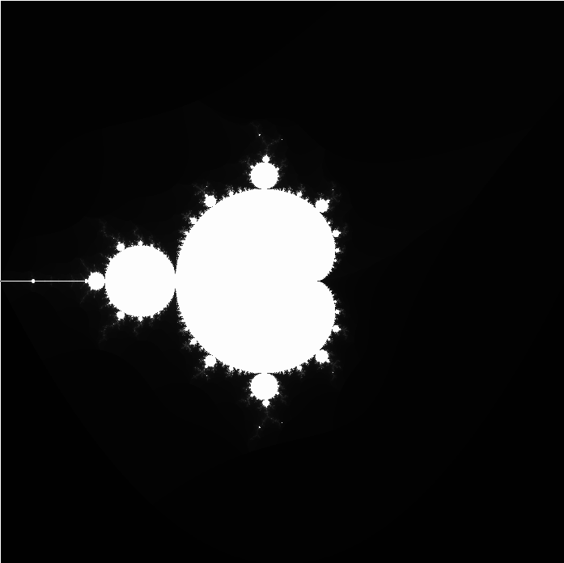

# Mandelbrot / Mandelplot

Mandelbrot set visualization that allows scrolling to zoom.

Built using SFML for the window and interactions and GL Shading Language for the pixels.

## Caveats

Float precision is off so the zoom level is limited.

## Prerequisites

This program was built with [SFML](https://www.sfml-dev.org/), so you'll need to install it before running.

## Usage
- `make`
- `./mandelplot`
- Scroll to zoom in and out.
- Press <kbd>q</kbd> or <kbd>ESC</kbd> to quit.

## Customizing the visualization
- You can customize the colors used in the visualization by updating the values in `shader.frag`.
- The intensity of the colors is slightly determined by the `MAX_ITERATIONS` constant defined in `shader.frag`. 
